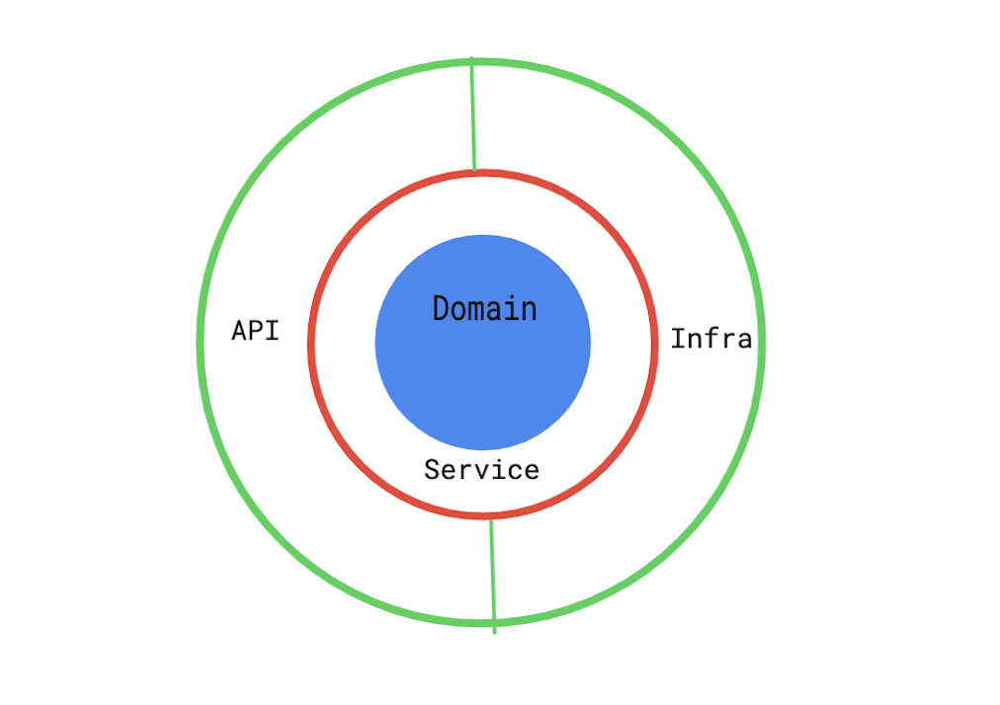

# BCUniversity
A demostration project with Domain Driven Deisgn and Onion Architecture, written with .Net Core 2.2

## Overview

### Onion Architecture


### Domain Design

Subject (AggregateRoot)  
|__ Lectures (Entity)  
&nbsp; &nbsp; &nbsp;|__ LectureSchedule (Value Object)  
&nbsp; &nbsp; &nbsp;|__ TheatreReference (Value Object)  
|__ StudentEnrolments (Value Object)  

Student (AggregateRoot)  
|__ SubjectEnrolments (Value Object)  

Theatre (AggregateRoot)  

### Limitation
* Personally I believe in domain design should have Persistence ignorance and it is not good to share persistence model with your domain. Therefore a data layer is presented in this practice. However, the data doesn't take into account of performance and the mapper is not doing the best it should.
* Unit tests is not written for this practice for timing reason
* Read model (CQRS) could be handy for this practice, but I didn't get to it. Instead I have introduced several value object that are read only.
* A domain service is used to handle inter-aggregate validation for enrolment. However, a saga (or process manager) may be a better solution.
* The following instruction is based on OSX or Linux. Should be easily adjusted to Windows
  
### Requirement
- .Net Core 2.2
- PostgreSQL
- Port 5432 and 5000
- Docker (optional)
  
### Run in local
Replace connection string with the your postgres connection string in [MigrationContextFactory.cs](src/BCUniversity.Infrastructure/Common/MigrationContextFactory.cs)
 and [appsettings.Development.json](src/BCUniversity.Api/appsettings.Development.json)

Or do the followint 
```
export POSTGRES_CONNECTIONSTRING=<Postgres connection string>
```

Execute the following to apply database migration
```
cd src/BCuniversity.Infrastructure
dotnet ef database update
```

Execute the following command to start the API
```
export ASPNETCORE_ENVIRONMENT=Development
export ASPNETCORE_URLS=http://localhost:5000
$ cd src/BCuniversity.Api
$ dotnet run
```
### Run with Docker
At the base directory, execute the following
```
docker-compose up
```
A database should be run for you and data should be seeded with API running.


### Data Seeded
Some data will be seeded for this practice. Refer to [SeedDataFactory.cs](src/BCUniversity.Infrastructure/Common/SeedDataFactory.cs) for details